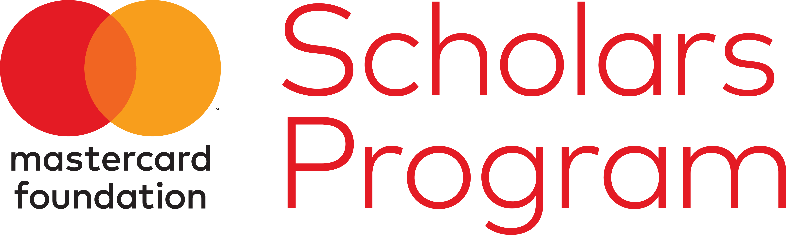

# Our Partnership

The Mastercard Foundation is a key partner of AIMS, supporting our mission to promote education and research in the mathematical sciences across Africa. Through this partnership, we aim to empower the next generation of leaders and innovators on the continent.

### About the Mastercard Foundation

The Mastercard Foundation is a global organization that aims to advance education and promote financial inclusion to catalyze economic growth in developing countries. Through its various initiatives, the Foundation seeks to empower individuals, particularly youth and women, by providing them with the necessary skills and resources to succeed in a rapidly changing world.
